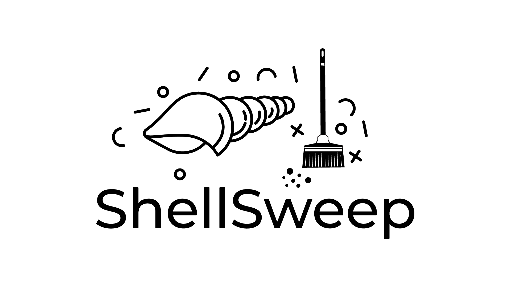

# ShellSweep
*ShellSweeping the evil*

## Why ShellSweep

"ShellSweep" is a PowerShell/Python/Lua tool designed to detect potential webshell files in a specified directory. 

ShellSheep and it's suite of tools calculate the entropy of file contents to estimate the likelihood of a file being a webshell. High entropy indicates more randomness, which is a characteristic of encrypted or obfuscated codes often found in web shellss.
- It only processes files with certain extensions (.asp, .aspx, .asph, .php, .jsp), which are commonly used in web shellss.
- Certain directories can be excluded from scanning.
- Files with certain hashes can be ignored during the scan.

### How does ShellSweep find the shells?

Entropy, in the context of information theory or data science, is a measure of the unpredictability, randomness, or disorder in a set of data. The concept was introduced by Claude Shannon in his 1948 paper "[A Mathematical Theory of Communication](https://people.math.harvard.edu/~ctm/home/text/others/shannon/entropy/entropy.pdf)".

When applied to a file or a string of text, entropy can help assess the randomness of the data. Here's how it works:
If a file consists of completely random data (each byte is just as likely to be any value between 0 and 255), the entropy is high, close to 8 (since log2(256) = 8).

If a file consists of highly structured data (for example, a text file where most bytes are ASCII characters), the entropy is lower.
In the context of finding web shellss or malicious files, entropy can be a useful indicator:
- Many obfuscated scripts or encrypted payloads can have high entropy because the obfuscation or encryption process makes the data look random.
- A normal text file or HTML file would generally have lower entropy because human-readable text has patterns and structure (certain letters are more common, words are usually separated by spaces, etc.).
So, a file with unusually high entropy might be suspicious and worth further investigation. However, it's not a surefire indicator of maliciousness -- there are plenty of legitimate reasons a file might have high entropy, and plenty of ways malware might avoid causing high entropy. It's just one tool in a larger toolbox for detecting potential threats.

ShellSweep includes a Get-Entropy function that calculates the entropy of a file's contents by:
- Counting how often each character appears in the file.
- Using these frequencies to calculate the probability of each character.
- Summing -p*log2(p) for each character, where p is the character's probability. This is the formula for entropy in information theory.

## Why ShellSweepX?

ShellSweepX takes the core functionality of ShellSweep to the next level, offering several advantages over traditional EDR (Endpoint Detection and Response) solutions:

1. **Specialized Focus**: Unlike EDR solutions that cast a wide net, ShellSweepX is specifically designed to detect web shellss. This specialized focus allows for more accurate and efficient detection of these particular threats.

2. **Low Resource Overhead**: ShellSweepX is lightweight and doesn't require constant background processes or system monitoring, unlike many EDR solutions. This means less impact on system performance.

3. **Customizable and Transparent**: The open-source nature of ShellSweepX allows for full transparency in its detection methods. You can easily customize and fine-tune the detection parameters to suit your specific environment.

4. **No Dependency on External Services**: ShellSweepX operates locally without relying on cloud-based analysis or constant updates, ensuring your sensitive data stays within your control.

5. **Multi-layered Detection**: ShellSweepX employs various detection methods including entropy analysis, pattern matching, and heuristic analysis, providing a comprehensive approach to web shell detection.

6. **Detailed Reporting**: ShellSweepX provides in-depth information about potential threats, including entropy values, detection methods, and confidence scores, allowing for more informed decision-making.

7. **Cross-Platform Compatibility**: With versions available in PowerShell, Python, and Lua, ShellSweepX can be deployed across various environments.

While ShellSweepX is not a replacement for a full-fledged EDR solution, it serves as a powerful, specialized tool in your security arsenal, particularly for environments where web shells pose a significant threat.

## Feature Comparison

| Feature/Aspect | ShellSweep | ShellSweepPlus | ShellSweepX |
|----------------|------------|----------------|-------------|
| Baseline Detection | Uses hardcoded entropy values for specific file extensions | Dynamic baseline detection that calculates entropy on-the-fly | Uses a combination of entropy-based detection and machine learning prediction |
| File Extensions | Processes files with extensions: .asp, .aspx, .asax, .jspx, .html, .ashx | Processes files with extensions: .asp, .ashx, .asax, .jspx, .html, .aspx | Configurable file extensions through API |
| Entropy Calculation | Calculates the entropy of file contents to detect potential web shellss | Enhanced entropy-based detection, cross-referencing with suspicious keywords | Advanced entropy calculation with chunk-based analysis | 
| Exclusion Feature | Can exclude certain directories from scanning | Can exclude certain directories from scanning | Configurable exclusions through API |
| Hash Ignoring | Ignores files with specific hashes | Ignores files with specific hashes | Configurable hash ignoring through API |
| Output | If potential web shellss are found, outputs file name, entropy value, and hash. Otherwise, prints "No evil identified today." | If potential web shellss are found, outputs file name, entropy value, hash, last modified date, detection method, and confidence score in JSON format. Otherwise, prints "No potential web shellss detected." | Detailed JSON output including file metadata, entropy, prediction results, and YARA matches |
| Entropy & Standard Deviation | Uses entropy values | Computes the mean and standard deviation of entropy values for each file extension | Calculates both entropy and standard deviation for advanced analysis |
| Mixed-Mode Detection | Not present | Uses a combination of entropy-based detection, standard deviation-based detection, and mixed-mode detection (utilizing standard deviation with hardcoded thresholds) | Combines entropy-based detection, machine learning prediction, and YARA rule matching |
| Static Code Analysis | Not present | Pattern-based detection mechanism analyzing code statically to identify and flag known malicious patterns | Utilizes YARA rules for pattern-based detection |
| Heuristic Analysis | Not present | Introduces Perform-HeuristicAnalysis function to detect anomalies based on heuristic rules, enhancing the detection of zero-day web shellss | Implements machine learning-based prediction for heuristic analysis |
| Detailed Result Presentation | Not present | Presents potential threats in a structured JSON format, including file path, entropy, standard deviation, hash, last modified date, detection method, and confidence score | Provides comprehensive results including all analysis methods in a structured JSON format |
| Comprehensive Logging | Not present | Incorporates Write-Verbose commands throughout the script for detailed logging and operational transparency | Implements verbose logging throughout the agent and server components |
| Confidence Scoring | Not present | Calculates a confidence score based on the detection method and adjusts it based on the presence of suspicious patterns | Uses machine learning prediction confidence and combines it with other detection methods for a comprehensive score |
| Modular Design | Not present | Utilizes separate functions for different tasks (e.g., Process-File, Create-ResultObject, Adjust-ConfidenceScore), promoting code reusability and maintainability | Highly modular design with separate components for agent, server, and analysis functions |
| Cross-platform Support | PowerShell only | PowerShell only | Supports PowerShell, Python, and Bash implementations |
| API Integration | Not present | Not present | Comprehensive API for configuration, result submission, and management |
| AI-powered Analysis | Not present | Not present | Incorporates AI-based triage and analysis capabilities |
| YARA Rule Management | Not present | Not present | Allows adding, updating, and deleting YARA rules through API |
| Web Interface | Not present | Not present | Provides a web-based interface for result visualization and analysis |
## ShellScan
ShellScan provides the ability to scan multiple known bad webshell directories and output the average, median, minimum and maximum entropy values by file extension.

Pass ShellScan.ps1 some directories of web shellss, any size set. I used:

- https://github.com/tennc/webshell
- https://github.com/BlackArch/web shellss
- https://github.com/tarwich/jackal/blob/master/libraries/

This will give a decent training set to get entropy values. 

Output example:

```
Statistics for .aspx files:
Average entropy: 4.94212121048115
Minimum entropy: 1.29348709979974
Maximum entropy: 6.09830238020383
Median entropy: 4.85437969842084
Statistics for .asp files:
Average entropy: 5.51268104400858
Minimum entropy: 0.732406213077191
Maximum entropy: 7.69241278153711
Median entropy: 5.57351177724806

```


## ShellCSV

First, let's break down the usage of ShellCSV and how it assists with identifying entropy of the good files on disk. The idea is that defenders can run this on web servers to gather all files and entropy values to better understand what paths and extensions are most prominent in their working environment.

See ShellCSV.csv as example output.

## ShellSweep

Blog: [Ghost in the Web Shell: Introducing ShellSweep](https://www.splunk.com/en_us/blog/security/ghost-in-the-web-shell-introducing-shellsweep.html)

First, choose your flavor: Python, PowerShell or Lua. 

- Based on results from ShellScan or ShellCSV, modify entropy values as needed.
- Modify file extensions as needed. No need to look for ASPX on a non-ASPX app.
- Modify paths. I don't recommend just scanning all the C:\, lots to filter.
- Modify any filters needed.
- Run it!

If you made it here, this is the part where you iterate on tuning. Find new shell? Gather entropy and modify as needed. 

## ShellSweepPlus

Blog: [Introducing ShellSweepPlus: Open-Source Web Shell Detection](https://www.splunk.com/en_us/blog/security/shellsweepplus-web-shell-detection-tool.html)

ShellSweepPlus is an advanced PowerShell script designed to detect and analyze potential web shellss in web environments. It builds upon the core functionality of ShellSweep, offering enhanced features and detection capabilities.

Key Features:
1. **Dynamic Scans**: Customizable scan parameters including directory paths, exclusions, and hash ignoring.
2. **Precision Entropy Thresholds**: Utilizes a sophisticated nested hashtable for tailored entropy thresholds across various file extensions.
3. **Multi-layered Detection**: Integrates 'Entropy-based', 'Standard Deviation-based', 'Mixed Mode', and 'Heuristic-based' detection methods with dynamic weights.
4. **Advanced Static Code Analysis**: Employs an extensive list of suspicious patterns for in-depth detection.
5. **Entropy Analysis**: Calculates and analyzes file content entropy to identify potentially obfuscated or encrypted malicious content.
6. **Detailed Result Presentation**: Outputs potential threats in a structured JSON format for easy parsing and analysis.
7. **Comprehensive Logging**: Includes verbose logging for detailed insights into the script's operations.
8. **Heuristic Analysis**: Implements heuristic-based detection to identify anomalies and potential zero-day web shellss.

Usage:
1. Specify directories to scan in the `$DirectoryPaths` variable.
2. Customize `$suspiciousPatterns` as needed for your environment.
3. Use `$excludePaths` to skip specific directories.
4. Utilize `$ignoreHashes` or `$ignoreHashesFilePath` to exclude known safe files.
5. Execute the script in PowerShell 5.1 or later.

Example output:

```
json
{
"TotalFilesScanned": 1000,
"Potentialweb shellss": 5,
"ScanDuration": "00:05:30"
}
```

ShellSweepPlus provides a powerful and flexible solution for webshell detection, combining multiple analysis techniques to improve accuracy and catch even sophisticated threats.


## Questions
Feel free to open a Git issue or check out the Wiki.

## Thank You

If you enjoyed this project, be sure to star the project and share with your family and friends. 